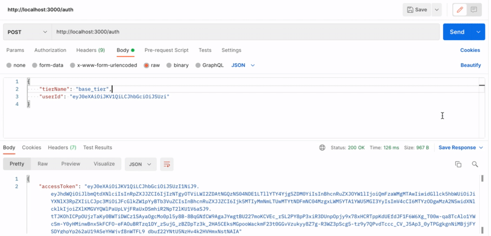

# Partner API Auth Proxy Sample Service

Auth proxy service for https://partner-content-api.epidemicsound.com/.
The main goal of the project is to act as an example of how our partners can build their own authentication proxy backends to access Partner API.
It is generally not recommended to keep partner authentication credentials on mobile devices and that is the main motivation for having this example in place.

## Goals

- Secure Partner Credentials by not exposing it in mobile App code
- Leverage expiration time for the Partner and User tokens

## Getting Started

The project requires NodeJS version `v14.18.1` or higher to be installed.
Install required dependencies with `npm install` and start development server with `npm dev`

## Configuration

The configuration uses environment variables that could be either directly set or read from the environment file.
Copy a configuration template and update values depending on your environment.
`cp .env.template .env`.
There are the following configuration options available:

`BASE_URL` - e.g. https://partner-content-api-sandbox.epidemicsound.com

`ACCESS_KEY` - Partner access key

`ACCESS_KEY_SECRET` - Partner access key secret

## Testing

Run `npm run test` to run test suit and check coverage in different formats.

## Usage

Application exposes `/auth` endpoint that expects to receive `POST` request
containing end-user id as `userId` e.g.:

```json
{
  "userId": "TWFyayB0aGlua3MgeW91J3JlIGF3ZXNvbWUh"
}
```



## Building Docker Image

The project contains a basic `Dockerfile` that could be used to generate production-ready
images
`docker build . -t papi-proxy:latest `.
That you can run after `docker run -p 3000:3000 papi-proxy:latest`
